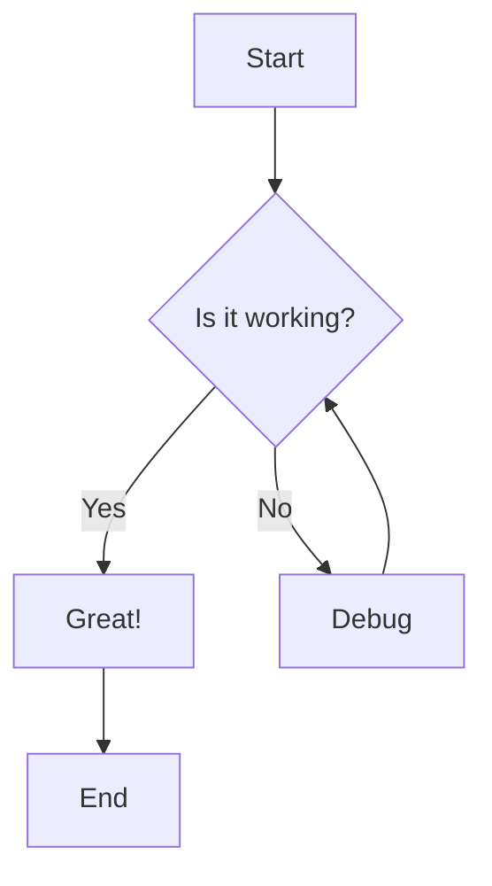
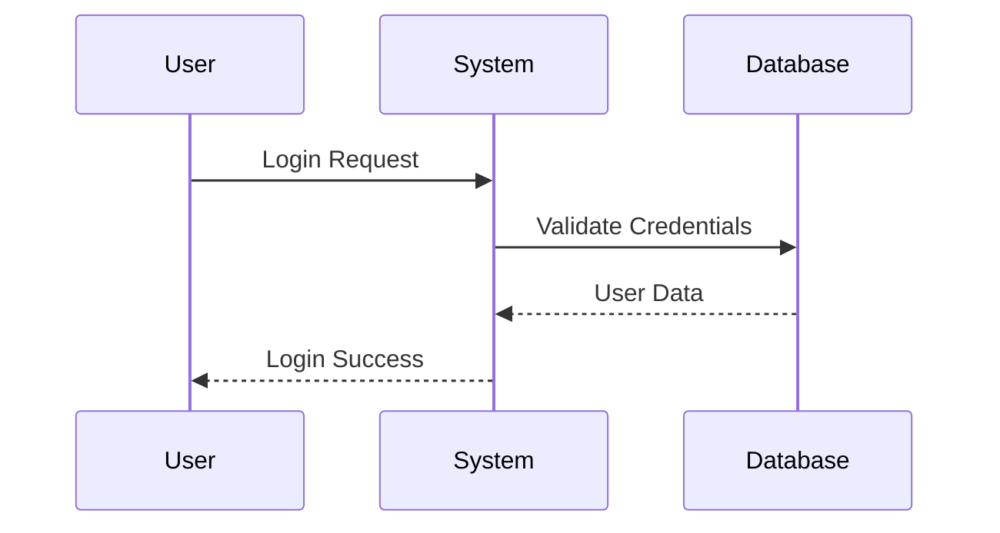
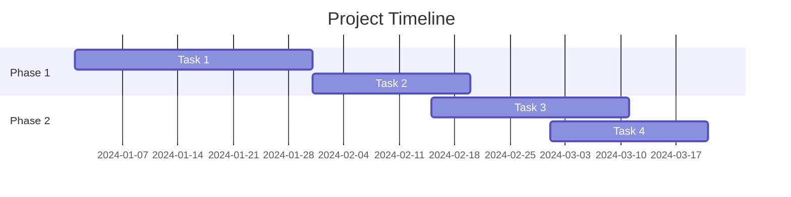
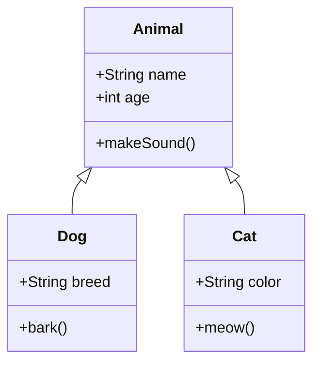
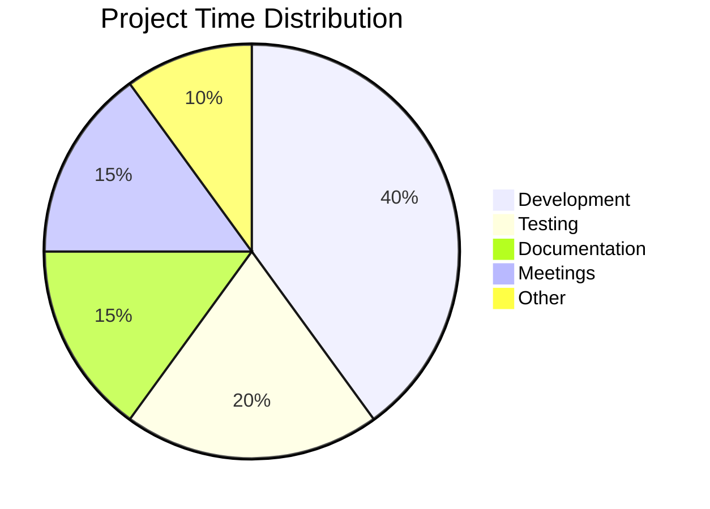
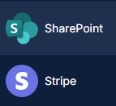

# GitHub-Flavored Markdown Features

This document demonstrates features specific to GitHub-Flavored Markdown (GFM).

## Task Lists

### Basic Task Lists

* [x] Completed task
* [x] Another completed task
* [ ] Uncompleted task
* [ ] Another uncompleted task

### Nested Task Lists

* [x] Main task completed
  * [x] Subtask 1 completed
  * [x] Subtask 2 completed
  * [ ] Subtask 3 pending
* [ ] Another main task
  * [ ] Subtask A
  * [ ] Subtask B

### Task Lists with Descriptions

* [x] **Setup project** - Initialize repository and configuration
* [x] **Install dependencies** - Run npm install or yarn install
* [ ] **Write tests** - Add unit and integration tests
* [ ] **Documentation** - Update README and docs
* [ ] **Deployment** - Deploy to production

## Emoji

### Smileys and Emotion

:smile: :laughing: :blush: :heart\_eyes: :kissing\_heart:

:relaxed: :satisfied: :grin: :wink: :stuck\_out\_tongue\_winking\_eye:

:sleeping: :worried: :frowning: :anguished: :cry:

### People and Body

:thumbsup: :thumbsdown: :ok\_hand: :punch: :fist: :v: :wave: :raised\_hand: :muscle:

:pray: :point\_up: :point\_down: :point\_left: :point\_right:

### Animals and Nature

:dog: :cat: :mouse: :rabbit: :bear: :panda\_face: :tiger:

:monkey: :see\_no\_evil: :hear\_no\_evil: :speak\_no\_evil:

:horse: :unicorn: :bee: :bug: :snail: :turtle:

:deciduous\_tree: :evergreen\_tree: :palm\_tree: :cactus: :tulip: :rose: :sunflower:

:sunny: :cloud: :umbrella: :snowflake: :zap: :fire: :droplet:

### Food and Drink

:apple: :banana: :grapes: :strawberry: :watermelon: :orange: :lemon:

:pizza: :hamburger: :fries: :hotdog: :taco: :burrito: :sushi:

:coffee: :tea: :beer: :wine\_glass: :cocktail: :cake: :birthday:

### Activities and Objects

:soccer: :basketball: :football: :baseball: :tennis: :8ball:

:trophy: :medal\_sports: :1st\_place\_medal: :2nd\_place\_medal: :3rd\_place\_medal:

:art: :book: :books: :notebook: :pencil2: :pen: :paintbrush:

:computer: :keyboard: :phone: :email: :calling: :camera: :video\_camera:

### Symbols

:heart: :yellow\_heart: :green\_heart: :blue\_heart: :purple\_heart:

:star: :star2: :sparkles: :boom: :fire: :zap: :bulb:

:white\_check\_mark: :x: :heavy\_check\_mark: :heavy\_multiplication\_x:

:arrow\_right: :arrow\_left: :arrow\_up: :arrow\_down:

:warning: :no\_entry: :question: :exclamation: :heavy\_plus\_sign: :heavy\_minus\_sign:

### Flags

:us: :uk: :canada: :australia: :france: :germany: :italy: :spain: :japan: :cn:

## Mentions

### User Mentions

You can mention users with @username (replace with actual username)

### Team Mentions

You can mention teams with @org/team-name

### Issue and PR References

Reference issues with #123

Reference pull requests with #456

Reference from another repo: owner/repo#789

## Automatic Linking

### URLs

https://github.com

http://example.com

www.github.com

### Issues and PRs

\#1 #42 #999

GH-1 GH-42 GH-999

### Commit References

Full SHA: 16c999e8c71134401a78d4d46435517b2271d6ac

Short SHA: 16c999e

### Cross-Repository References

user/repo#123

user/repo@16c999e

## Strikethrough

~~This text is struck through~~

~~Multiple~~ ~~strikethrough~~ ~~words~~

This is ~~old information~~ updated information.

## Tables (GFM Enhancement)

### Standard Table

| Column 1 | Column 2 | Column 3 |
| -------- | -------- | -------- |
| Cell 1   | Cell 2   | Cell 3   |
| Cell 4   | Cell 5   | Cell 6   |

### Table Without Leading/Trailing Pipes

| Column 1 | Column 2 | Column 3 |
| -------- | -------- | -------- |
| Data 1   | Data 2   | Data 3   |
| Data 4   | Data 5   | Data 6   |

### Compact Table

| A | B | C |
| - | - | - |
| 1 | 2 | 3 |
| 4 | 5 | 6 |

## Syntax Highlighting

### JavaScript with Line Highlighting

```javascript
function greet(name) {
  console.log(`Hello, ${name}!`);  // This line is important
  return name;
}
```

### Multiple Languages

```python
def fibonacci(n):
    if n <= 1:
        return n
    return fibonacci(n-1) + fibonacci(n-2)
```

```ruby
def factorial(n)
  return 1 if n <= 1
  n * factorial(n - 1)
end
```

## Footnotes

Here's a sentence with a footnote.

Another sentence with another footnote.

You can also use inline footnotes^\[Like this one].

## Definition Lists (Some GFM renderers)

Term 1 : Definition for term 1

Term 2 : Definition for term 2 : Another definition for term 2

## Autolinked References

### SHA References

16c999e8c71134401a78d4d46435517b2271d6ac

16c999e

### Issue References

\#1 #42 #999

### User References

@octocat @github

## Diagrams (Mermaid)

### Flowchart



### Sequence Diagram



### Gantt Chart



### Class Diagram



### Pie Chart



## Alerts and Callouts

### Note

> \[!NOTE] Highlights information that users should take into account.

### Tip

> \[!TIP] Optional information to help a user be more successful.

### Important

> \[!IMPORTANT] Crucial information necessary for users to succeed.

### Warning

> \[!WARNING] Critical content demanding immediate user attention due to potential risks.

### Caution

> \[!CAUTION] Negative potential consequences of an action.

## Collapsed Sections

<details>

<summary>Click to expand code example</summary>

```javascript
function complexFunction() {
  const data = fetchData();
  const processed = processData(data);
  return processed;
}
```

</details>

<details>

<summary>System Requirements</summary>

#### Minimum Requirements

* OS: Windows 10 / macOS 10.15 / Linux
* RAM: 8GB
* Storage: 256GB SSD
* Processor: Intel i5 or equivalent

#### Recommended Requirements

* OS: Latest version
* RAM: 16GB or more
* Storage: 512GB SSD or larger
* Processor: Intel i7 or better

</details>

## Color Chips

`#0969DA` `#1f883d` `#A371F7`

Background: `rgb(9, 105, 218)` `rgb(31, 136, 61)` `rgb(163, 113, 247)`

HEX: `#FF5733` `#33FF57` `#3357FF`

## Mathematical Expressions (LaTeX)

### Inline Math

This is an inline equation: $E = mc^2$

Another example: $\sqrt{x^2 + y^2}$

### Block Math

$$
\int_{a}^{b} f(x) dx = F(b) - F(a)
$$

$$
\sum_{i=1}^{n} i = \frac{n(n+1)}{2}
$$

$$
\begin{bmatrix}
a & b \\
c & d
\end{bmatrix}
$$

## Diff Syntax

```diff
function example() {
-  const old = "old value";
+  const new = "new value";
   return result;
}
```

## Keyboard Shortcuts

Press <kbd>Ctrl</kbd> + <kbd>C</kbd> to copy

Press <kbd>Ctrl</kbd> + <kbd>V</kbd> to paste

Press <kbd>Cmd</kbd> + <kbd>Shift</kbd> + <kbd>P</kbd> on Mac

## GitHub-Specific Features Testing

### Relative Links

[Link to another doc](01-tables.md)

[Link to specific section](02-images.md#basic-image-syntax)

### Uploaded Images



***

**Note**: Some features may only work on GitHub's platform or with specific markdown renderers that support GitHub-Flavored Markdown.
